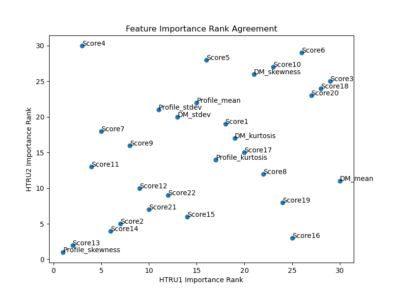
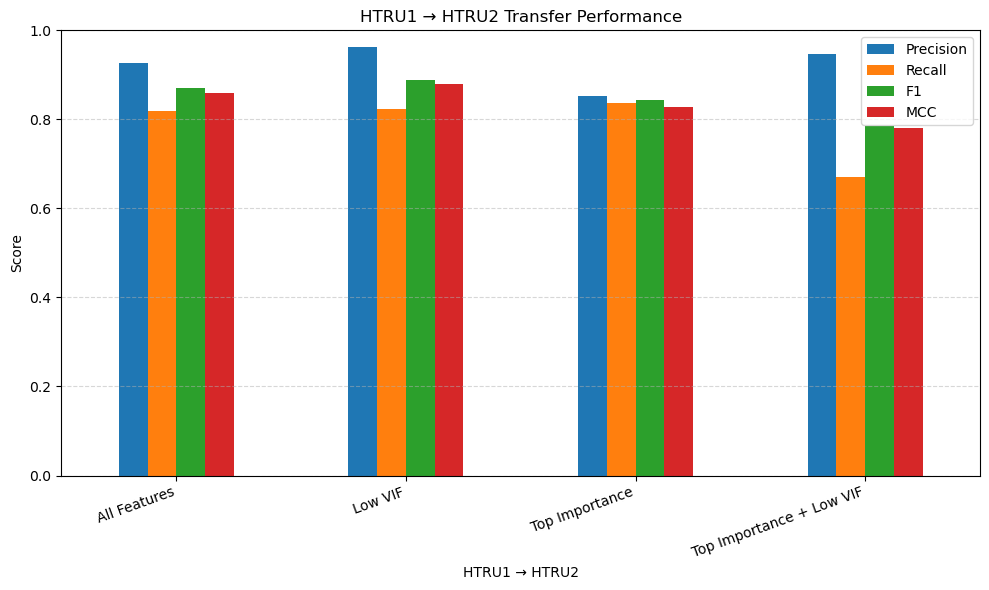
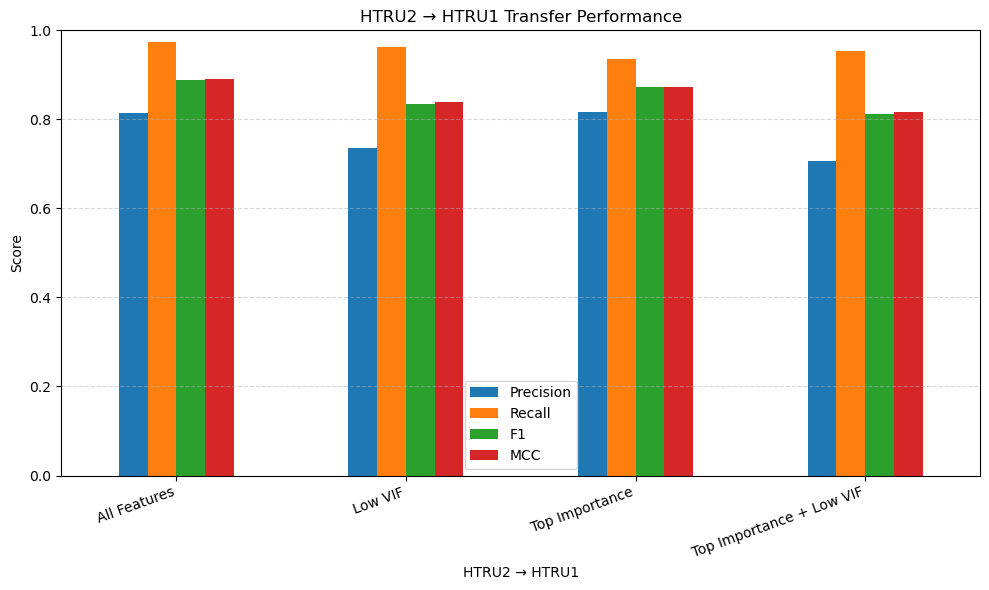

# Pulsar-Ensemble-Classification

## Project Goal
Distinguishing between real pulsars and radio frequency interference has posed a long-standing challenge in radio astronomy. Machine learning methods offer a promising solution for building a more efficient pipeline for collecting high-volume data on pulsars using radio telescopes. Thus, this project's main goals are the following:

1. Build robust ensemble learning models (XGBoost and random forest) for classifying pulsar candidates.
2. Investigate feature selection and cross-dataset generalization using the HTRU1 and HTRU2 datasets.

## Research Questions

1. Which features are most predictive?
2. Which features are redundant?
3. Does feature reduction improve cross-dataset performance?

## Methods

- Feature Distribution Analysis
- Feature Correlation Analysis
- Variance Inflation Factor
- XGBoost Feature Importance
- Random Forest Feature Importance
- Cross-Dataset Testing

## Results 
1. Feature Analysis:
 - Models trained on both datasets agreed on some of the most important features such as skewness of the integrated pulse profile and best S/N value.
 - The two models disagreed on most of the feature importances.

 - Many of the top importance features for the HTRU2 model exhibited high multicollinearity with other features.
 - For HTRU1 model, only the profile skewness had a high VIF among the top importance features.

2. Model Performance:
- Models trained and tested on the same dataset generally performed well across all metrics, especially the model trained on the HTRU1 dataset due to its larger volume.
- The cross-dataset testing experiment revealed slightly worse overall performance as seen in the figure below.
- The model trained on HTRU1 had more stable performance across accuracy, precision, F!, and MCC compared to the HTRU2 model.
- The HTRU1 model performance improved across all metrics when the features with with low VIF were selected for training.
- In constrast, the HTRU2 model performed the best without selecting low VIF or top importance features.

## Datasets

This project uses data from the High Time Resolution Universe Survey. The source for the HTRU 1 and HTRU 2 datasets can be found at:
https://github.com/scienceguyrob/PulsarFeatureLab/

References:

[1] R. J. Lyon, B. W. Stappers, S. Cooper, J. M. Brooke, J. D. Knowles, Fifty Years of Pulsar Candidate Selection: From simple filters to a new principled real-time classification approach, Submitted to MNRAS.

[2] R. J. Lyon et al., "Fifty Years of Pulsar Candidate Selection: From simple filters to a new principled real-time classification approach", Submitted to Monthly Notices of the Royal Astronomical Society.

[3] S. D. Bates et al., "The high time resolution universe pulsar survey vi. an artificial neural network and timing of 75 pulsars", Monthly Notices of the Royal Astronomical Society, vol. 427, no. 2, pp. 1052-1065, 2012.

[4] D. Thornton, "The High Time Resolution Radio Sky", PhD thesis, University of Manchester, Jodrell Bank Centre for Astrophysics School of Physics and Astronomy, 2013.
